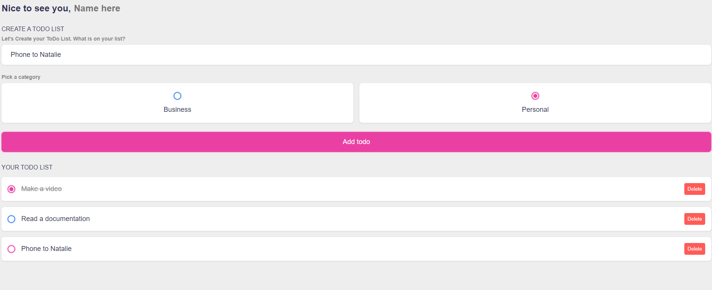

# ToDo App

This template should help get you started developing with Vue 3 in Vite.

## Preview



## Features

This project implements the basic features of the ToDo App:

Enter the task
Select a category
Mark items as done/not done
Add/remove item
VueJS [^VITE v4.3.9]


## Project Setup

```sh
npm install
```

### Compile and Hot-Reload for Development

```sh
npm run dev
```

### Compile and Minify for Production

```sh
npm run build
```

